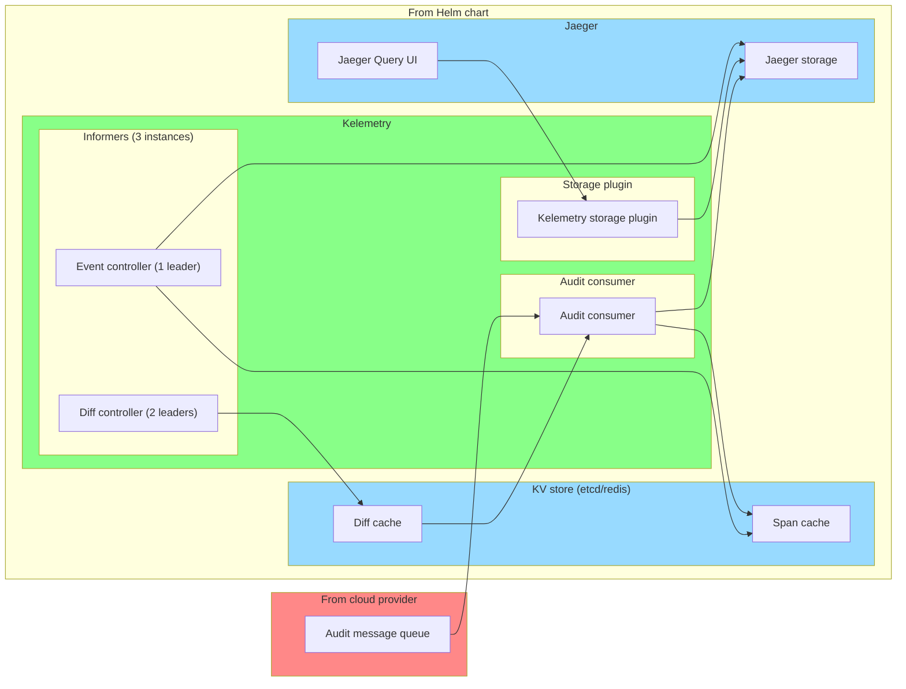

# Deploying Kelemetry for Production Clusters

To minimize data loss and latency and ensure high availability,
we recommend deploying Kelemetry in 3 separate components:
consumers, informers and storage plugin.

This setup is bundled into a Helm chart.
TODO
