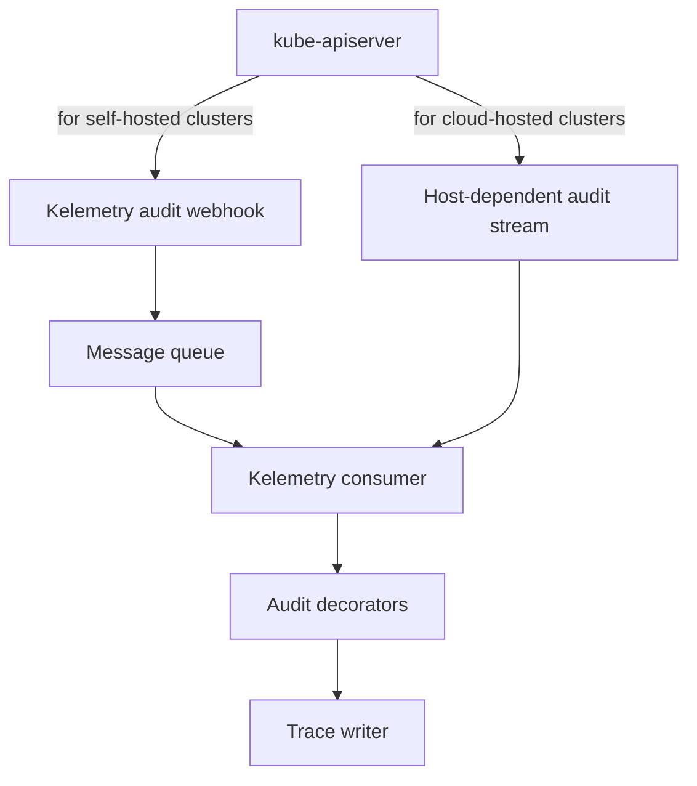
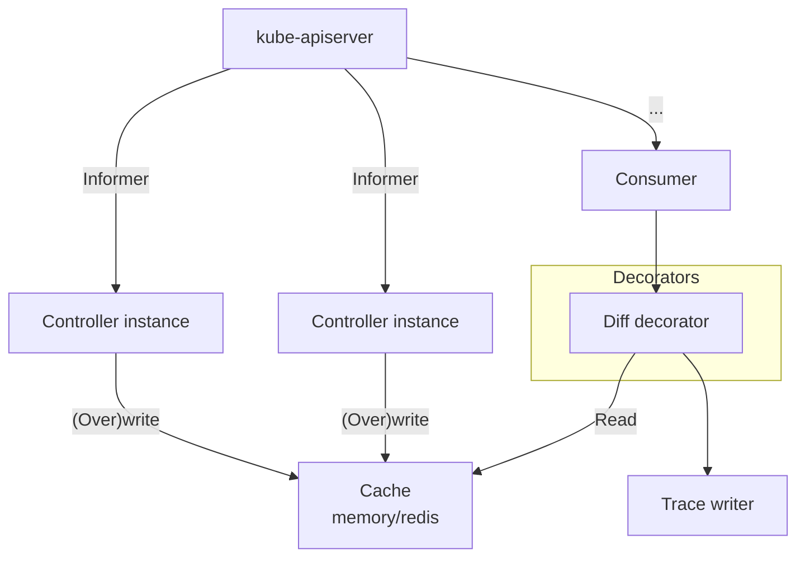
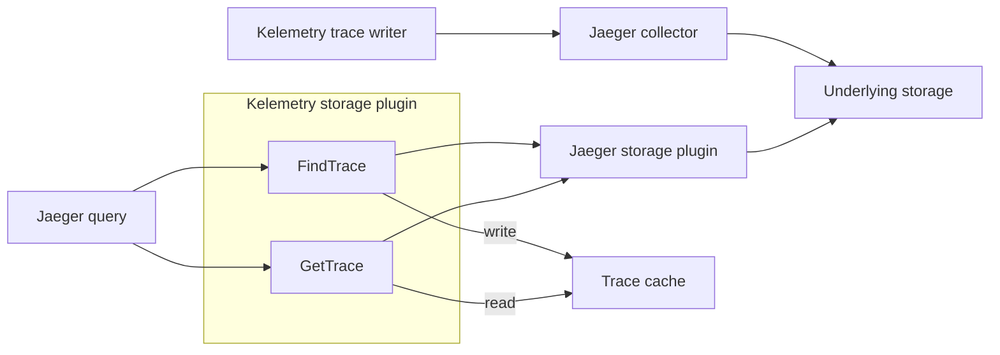

# Developer manual

## Setting up a local test cluster

The development setup is streamlined into three steps:

1. Ensure the prerequisites are available:
  - [kind](https://kind.sigs.k8s.io)
  - [docker-compose](https://docs.docker.com/compose/install/)

2. Create the kind cluster and dependency services:

```console
$ make kind stack
```

3. Compile and run the kelemetry all-in-one executable:

```console
$ make
```

4. Open <http://localhost:16686> in your browser to view the trace output with Jaeger UI.

## Extending Kelemetry

### Component manager

Kelemetry uses a component-oriented design.
Dependency components are automatically enabled if any of its (transitive) dependents is enabled.


New components can be added simply by importing their package.
All default packages are imported in [pkg/imports.go](pkg/imports.go).
You can also build your custom binary by importing `github.com/kubewharf/kelemetry/pkg`
along with your custom component packages
and calling `"github.com/kubewharf/kelemetry/cmd".Run()`.

In particular, the blue components are interfaces that can be extended with "mux components".

#### Singleton component

A singleton component is a component that cannot be swiched to a different implementation.

In the package that defines the singleton component,
create a `func init()` that registers the component:

```go
func init() {
  manager.Global.Provide("component-name", componentConstructor)
}
```

If the component package is not directly imported
(e.g. because it is a direct user-facing component with no direct dependents),
import it explicitly in `pkg/imports.go`.

The return type of `componentConstructor` uniquely identifies this component.
It can take any number of parameters whose type is the return type of
another component constructor in a dependency package.
The constructor should only initialize fields but not perform any actions.

The returned value must implement the `manager.Component` interface,
which provides the following methods:

- `Options()` returns an options object that contains the component options.
  - `Options().Setup()` registers options to a `pflag.FlagSet` and stores them in the object.
  - `Options().EnableFlag()` returns a nil-able bool that indicates whether the component should be enabled.
    - If it returns `&true` or `&false`, the component is always enabled/disabled.
    - If it returns `nil`, the component is enabled only if it has an enabled dependent component.
- `Init()` performs the initialization logic after all options have been parsed.
  The manager calls `Init()` on dependencies before its dependents, all on the main goroutine.
  However, the actual long-running tasks should not be started until `Start()` is called;
  only initialize states like registering handlers for other components.
  Example tasks in `Init` include:
  - Validating options
  - Register informer types and handlers
  - Initialize connection pools
  - Register metrics
- `Start()` starts the goroutines that actually perform work.
  The manager only calls `Start()` after `Init()` has been called on all components,
  and in the same order as `Init`, all on the main goroutine.
  The started goroutines should terminate when the given `stopCh` is closed.
- `Close()` should block until the components have fully shut down.
  It is only called after `stopCh` has been closed.
  `Close()` is called in the reverse order of `Init` and `Start`.

#### Mux components

A mux component is an interface that may have multiple implementations.
For example, the cluster name resolver component allows users to
customize their implementations of cluster name resolution (e.g. through IP address lookup).

The interface itself is registered as a normal single component,
with the constructor returning an object that embeds `*manager.Mux`
(and thus inherits its methods).
The interface does not need to include `manager.Component` in its declaration;
this allows easier mocking in unit tests.

The implementations are registered with a slightly different API:

```go
func init() {
  manager.Global.ProvideMuxImpl("interface-name/implementation-name", implementationConstructor, Interface.AnyMethod)
}
```

The third parameter can be any function whose first parameter is the interface type.

Implementations do not necessarily need to implement the interface directly,
as long as the object returned in the interface constructor knows how to delegate to the implementation,
although this increases the complexity for unit testing.

The implementation also implements the `manager.Component` interface,
and additionally embeds `manager.MuxImplBase` and provides the method `MuxImplName`.
Only one component in the whole project can return `true` in the `isDefault` return value of `MuxImplName`.
It must return `nil` for `Options.DisableFlag`
and would be disabled if it is not selected in the options.

### Audit

The `audit` package provides an audit webhook server and trace event provider based on audit webhook.
It has the following subpackages:

- `webhook`: Runs the audit webhook HTTP server and broadcasts them to registered subscribers through an in-memory channel.
- `producer`: Receives events from the webhook and sends them to the message queue, with only one message per event.
- `rawproducer`: Receives events from the webhook and sends them to the message queue,
  but each message contains all events from an `EventList` sent by kube-apiserver in one request.
- `consumer`: Consumes events from the message queue, transforming the audit events into the corresponding span(s).
- `decorator`: Allows other components to decorate trace events before they are sent to the trace aggregator.
- `dump`: Dumps audit events received from the webhook to a log file, one line of JSON object per event. For debugging.
- `forward`: Proxies audit events to other HTTP servers. Used when multiple webhook servers are configured in a chain.
- `mq`: Implements the message queue for producer and consumer.
  In public cloud scenarios, specially customized implementations may be required
  to retrieve audit events from the vendor-specific message queue.



### Cluster name

The `clustername` package resolves an audit webhook client IP into a cluster name.

### Diff

The `diff` package decorates audit events with the object diff.
It has the following subpackages:

- `controller`: List-watches all objects on the target cluster, compares the patch and sends the result to the diff cache.
- `cache`: Caches the object patches from the diff controller.
- `decorator`: If audit events are sent at the ResponseObject level, create and delete events are populated with the object body.
  If the diff controller is enabled, update events are populated with the object diff.
- `cmp`: implements the object comparison logic



### Filter

The `filter` package registers generic options for determining whether an object should be traced.

### K8S client

The `k8s` package wraps kubernetes clients and informers.
Each process has a "target" cluster and also a set of other available clusters upon request.

#### Config

The `k8s/config` package provides the kubeconfigs for different clusters,
and determines the name of the target cluster.

#### Multileader

The `k8s/multileader` package provides utilities to perform multi-leader election,
allowing a fixed number (&ge; 1) of distinct instances to acquire the leader lease.
This is used in diff controllers where multiple parallel instances are allowed.

#### Discovery

The `k8s/discovery` package provides utilities for mapping the GVR &harr; default GVK conversion.
This does not account for subresources.

### Event

The `event` package list-watches event objects from the target cluster,
transforming new events into the corresponding spans.

Maintains a `namespaces/default/configmaps/kubetrace-event-controller` object
to store the latest receiveed event timestamp
to avoid resending all events after restart.
Furthermore, events older than 5 minutes are discarded
as they are assumed to be the consequence of relisting.

### Metrics

The `metrics` package abstracts metric reporting.
Each metric should be paired with a pointer-to-struct that contains the metric tags.

### Aggregator

The `aggregate` package aggregates all span linking,
and sends them to the `aggregate/tracer` package which
implements the trace dispatcher and sends the actual trace.

The aggregator accepts "events" from data sources,
where an event is associated with a K8S object.
"Linkers" are invoked recursively to determine the "parent" object of the associated object,
thus placing the span under the same trace as other events under the same ancestor objects.

### Span cache

The `spancache` package abstracts an expiring `map[string][]byte` cache.
A local layer of cache is provided to reduce cache penetration.

### Jaeger

The packages under `jaeger` provide components related to Jaeger UI.
It provides a Jaeger storage plugin wrapper
that transforms the trace tree to a more user-friendly view.
When the storage plugin returns a list of traces,
it renames the trace ID to a "cache ID",
which is the key of an internal cache that stores the actual trace ID,
desired object span and the display configuration.



- `backend`: Retrieves data from the storage that holds the output of `tracer`.
- `clusterlist`: Provides the list of cluster names.
  This is different from the `clustername` package,
  which may support a wider range of cluster names (i.e. all clusters in the infrastructure),
  while this package is only intended for clusters with Kelemetry installed.
- `http`: Provides an HTTP endpoint that takes in raw query params and redirects to the correct Jaeger UI page.
  This service should be proxied behind the `/redirect` endpoint of an nginx server together with the Jaeger UI.
- `reader`: Implements the `SpanReader` gRPC endpoint.
- `tf`: Transforms the trace output to a more user-friendly UI.
  - `config`: Configuration database for the different display modes.
  - `step`: Implements the transformation steps, used in the config implementations.
- `tracecache`: Implements the mapping from Cache ID to Trace ID.
