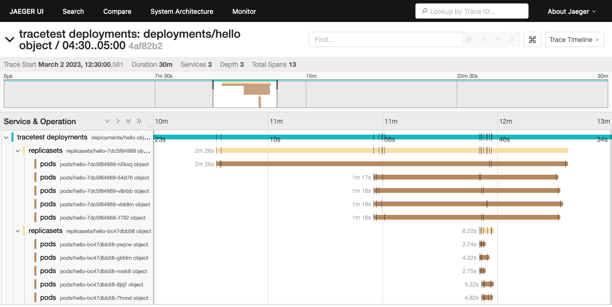
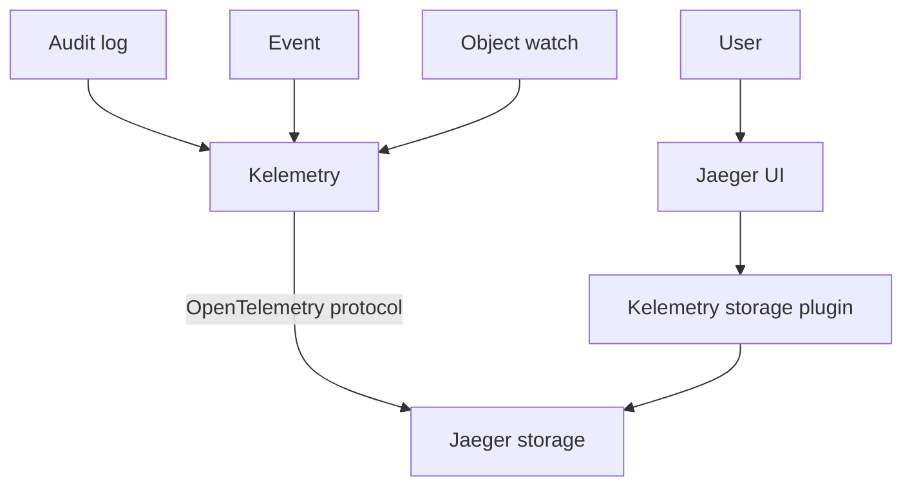

# Kelemetry: Global control plane tracing for Kubernetes

## Overview

Kelemetry aggregates various data sources including
Kubernetes events, audit log, informers
into the form of traditional tracing,
enabling visualization through Jaeger UI and automatic analysis.

## Motivation

As a distributed asynchronous declarative API,
Kubernetes suffers from lower explainability compared to traditional RPC-based services
as there is no clear causal relationship between events;
a change in one object indirectly effects changes in other objects,
posing challenges to understanding and troubleshooting the system.
Past attempts of tracing in Kubernetes were either limited to single components
or excessively intrusive to individual components.

Kelemetry addresses the problem by associating events of related objects into the same trace.
By recognizing object relations such as OwnerReferences,
related events can be visualized together without prior domain-specific knowledge.
The behavior of various components are recorded on the same timeline
to reconstruct the causal hierarchy of the actual events.

## Features

- [x] Collect audit logs
- [x] Collect controller events (i.e. the "Events" section in `kubectl describe`)
- [x] Record object diff associated with audit logs
- [x] Connect objects based on owner references
- [x] Collect data from custom sources (Plugin API)
- [x] Connect objects with custom rules with multi-cluster support (Plugin API)
- [x] Navigate trace with Jaeger UI and API
- [x] Scalable for multiple large clusters

## Getting started

- [Deployment](./docs/DEPLOY.md) for production
- [Quickstart](./docs/QUICK_START.md) for trying out Kelemetry with a test cluster
- [Development setup](./docs/DEV.md) for developing Kelemetry

## Contribution/Development

- [Contributing guidelines](CONTRIBUTING.md)
- [Developer manual](./docs/DEV.md)
- [Security policy](SECURITY.md)
- [User guide](./docs/USER_GUIDE.md)

## Code of Conduct

See [Code of Conduct](CODE_OF_CONDUCT.md).

## Community

- [Discussions](https://github.com/kubewharf/kelemetry/discussions)

## License
Kelemetry is licensed under [Apache License 2.0](LICENSE).
