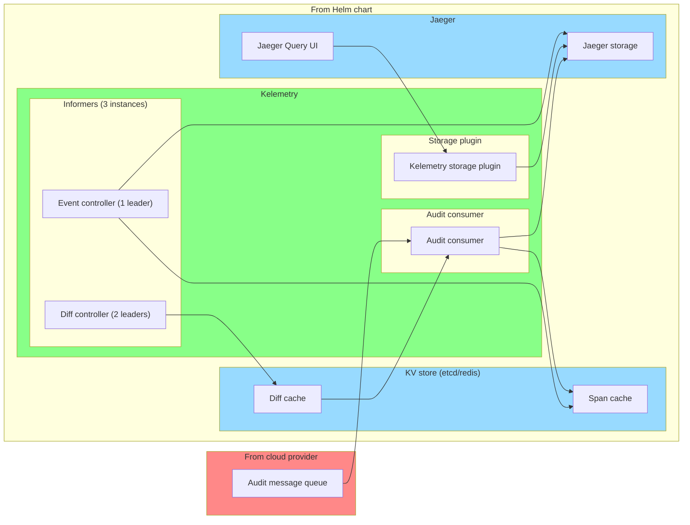

# Deploying Kelemetry for Production Clusters

> Note: Due to the variety of cloud providers and cluster management solutions,
> deploying Kelemetry for production might be tricky.
> If you just want to try out the features of Kelemetry,
> follow the [quick start guide](QUICK_START.md) instead,
> which sets up a basic stack locally using Docker.

To minimize data loss and latency and ensure high availability,
we recommend deploying Kelemetry in 3 separate components:
consumers, informers and storage plugin.

This setup is bundled into a Helm chart.

## Steps

1. Download [`values.yaml`](/charts/kelemetry/values.yaml) and configure the settings.
2. Install the chart: `helm install kelemetry oci://ghcr.io/kubewharf/kelemetry-chart --values values.yaml`
3. If you use an audit webhook directly, remember to
   [configure the apiserver](https://kubernetes.io/docs/tasks/debug/debug-cluster/audit/#webhook-backend)
   to send audit logs to the webhook:

The default configuration is designed for single-cluster deployment.
For multi-cluster deployment, configure the `sharedEtcd` and `storageBackend` to use a common database.

### Troubleshooting
Run `kubectl exec kelemetry-scan-0 -- scan`.
It should report a few key metrics and provide suggestions if the metrics look wrong.

All containers running the Kelemetry image export Prometheus metrics on the `metrics` (9090) port.
Jaeger containers export Prometheus metrics on the [`admin` port](https://www.jaegertracing.io/docs/latest/deployment/).
You may set up your own monitoring based on the available metrics.
